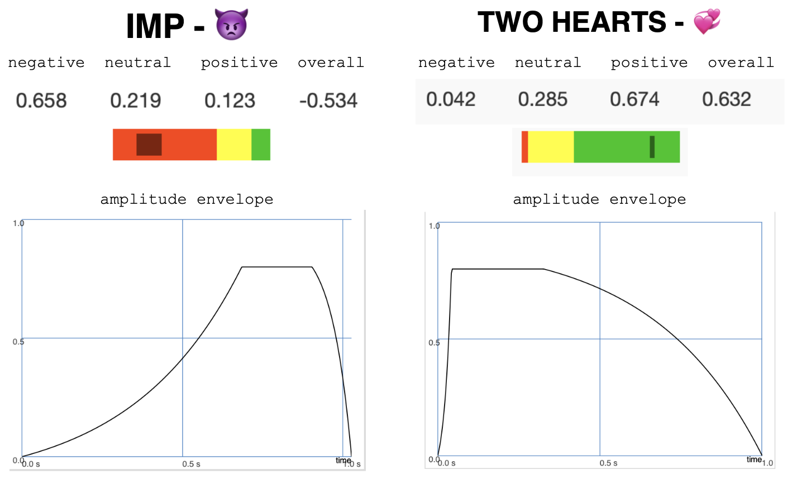

## Positive Pixel: The Sound of Emojis
20.09.2021

Laurin Dahm and Luzie Ahrens

This project was developed as part of the seminar "Network Systems for Music Interactions" instructed by Henrik von Coler at TU Berlin (2021). It is an approach to the sonification of a livechat consisting of emojis. The sound an emoji creates varies depending on the sentiment they carry. The sentiment scores for this project are taken from ["Sentiment of Emojis"](https://journals.plos.org/plosone/article?id=10.1371/journal.pone.0144296) (Novak et al. 2015). More specificly, this website: [Emoji Sentiment Ranking v1.0](http://kt.ijs.si/data/Emoji_sentiment_ranking/).
 ________________________________________________________________________________________________
 
 ## README-Content
1. Documentation
   1. Demo Videos
   2. General Project Structure
   3. SuperCollider: Structure, Synth-Explanation
2. Installation
3. Usage

________________________________________________________________________________________________
## Documentation

### 1. Demo Videos

A video demonstrating the binaural sound and usage of the interface can be found here: [Demo Binaural System](https://vimeo.com/616841018/710a24b078).

A video of the "Electronic Orchestra Charlottenburg" using the previous, non-binaural system can be found here: [Demo Orchestra](https://vimeo.com/616843419/0ef7e9712f).


### 2. General Project Structure


In general, the participants connect to the server and can send emojis together with directive localisation info (azimuth, elevation). The python-server then grabs the sentiment information about the emojis and sends an osc-message. The SC-server receives the message and creates a binaural sound based on the information (making use of the [SC-HOA library](https://github.com/florian-grond/SC-HOA) by Florian Grond).

### 3. SuperCollider: Structure


SuperCollider receives OSC-Messages via an OSC-Listener. The OSC-Message is always in the following format:

```bash
-keyword -overall -negative -neutral -positive -azimuth -elevation
```

**Ranges**:<br>
```bash
overall (overall sentiment score): -1 to 1
negative (negative sentiment score): 0-1
neutral (neutral sentiment score): 0-1
positive (positive sentiment score): 0-1
azimuth: -pi/2 to pi/2
elevation: -pi/2 to pi/2
```

### 3. SuperCollider: Synthesized Sounds
The arguments from the OSC-message are given to one of four synth-definitions in SuperCollider (chosen randomly each time).<br>
The synth-definitions do several things:<br>

1. they create a signal.<br>
2. they create an amplitude-envelope for the signal according to the sentiment values.<br>
3. they create a binaural encoder with the azimuth and elevation from the OSC-message.<br>
4. they send the signal to the ambisonics bus.

The binaural decoder further processes the signal and makes it audible by sending it to the SC-output (default 0).

#### Influence of the sentiment scores on the sound

The attack, sustain and release of the created sounds depends on the negative, neutral and positive sentiment scores of the given emoji. The negative score is mapped to the attack time, the neutral score to the sustain time and the positive score to the release time.



Very negative emojis will therefore have a long attack and a short release, whereas positive emojis have a short attack and a long release.

________________________________________________________________________________________________

## Installation
**PARTICIPANTS** must have the following installed:

**Python 3.6**

**Python-packages**: pyqt5, sockets

All python-packages can be install via pip.

```bash
pip install pyqt5
pip install sockets
```


________________________________________________________________________________________________
The **HOST** must have the following installed:

**SuperCollider 3.11**

**Python 3.6**

**Python-packages**: sockets, threading, oscpy, json

All python-packages can be install via pip.

```bash
pip install threading
pip install sockets
pip install oscpy
pip install json
```

**PARTICIPANTS** as well as the **HOST** need to pull this git-repo.

```bash
git pull https://github.com/LolBaum/Emoji_Sound.git
```
________________________________________________________________________________________________

## Usage

### HOST: 1. Running the SuperCollider-Script

Run the SC-script **sc_server_binaural.scd** which can be found in the folder /SC.<br>
You can run it via the SC-IDE or via shell/terminal command:

```bash
sclang SC/sc_server_binaural.scd 
```

### HOST: 2. Start the Python-Server

Start the server by running the python-script **server.py** which can be found in the folder /Python.<br>
You can run it via a Python-IDE or via shell/terminal command:

```bash
python3 Python/server.py <SERVER IP-ADDRESS>
```
If you don't specify a server IP-address it will run on your localhost (which can be used just fine for testing).

### PARTICIPANTS: Connect to the Server

Participants can open the interface via the script **emoji_client_socket.py** which can be found in the folder /Python.

```bash
python3 Python/emoji_client_socket.py <SERVER IP-ADDRESS>
```
If no server IP-address is specified, it will try to connect to your localhost.

Participants can use the interface to choose their username, dis-/reconnect to the server and change the server-IP and port. Once they are connected, they are able to send emojis to the server (by clicking on them) and also change the azimuth and elevation.
