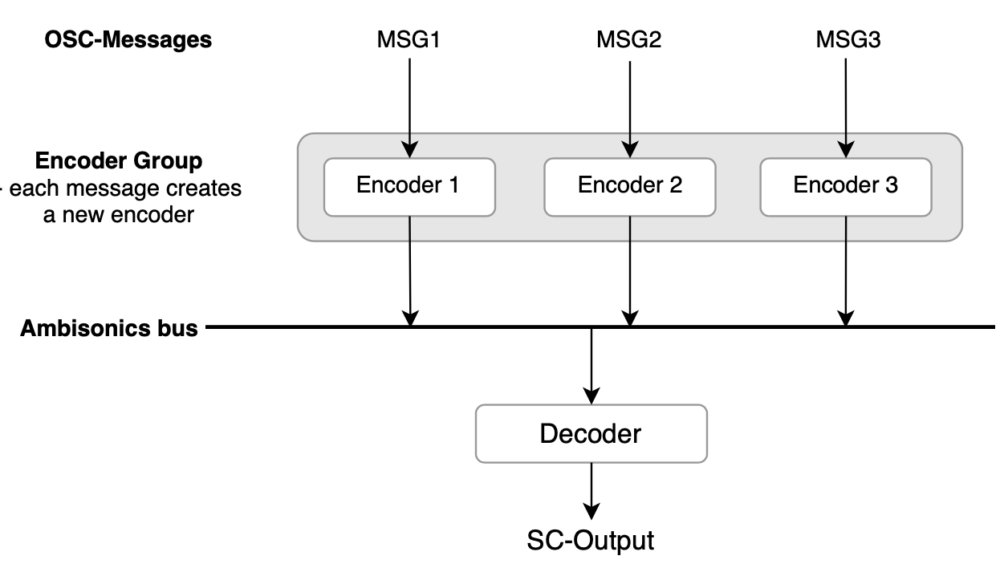

## Positive Pixel: The Sound of Emojis
20.09.2021

Laurin Dahm and Luzie Ahrens

This project was developed as part of the seminar "Network Systems for Music Interactions" instructed by Henrik von Coler at TU Berlin (2021). It is an approach to the sonification of a livechat consisting of emojis. The sound an emoji creates varies depending on the sentiment they carry. The sentiment scores for this project are taken from ["Sentiment of Emojis"](https://journals.plos.org/plosone/article?id=10.1371/journal.pone.0144296) (Novak et al. 2015).
 ________________________________________________________________________________________________

## Documentation

### General


In general, the participants connect to the server and can send emojis together with directive localisation info (azimuth, elevation). The python-server then grabs the sentiment information about the emojis and sends an osc-message. The SC-server receives the message and creates a binaural sound based on the information (making use of the [SC-HOA library](https://github.com/florian-grond/SC-HOA) by Florian Grond).

### SuperCollider Structure



SuperCollider receives OSC-Messages via an OSC-Listener. The OSC-Message is always in the following format:

```bash
-keyword -overall -negative -neutral -positive -azimuth -elevation
```

**Ranges**:<br>
```bash
overall (overall sentiment score): -1 to 1
negative (negative sentiment score): 0-1
neutral (neutral sentiment score): 0-1
positive (positive sentiment score): 0-1
azimuth: -pi/2 to pi/2
elevation: -pi/2 to pi/2
```

### Synth-Definitions
The arguments from the OSC-message are given to one of four synth-definitions, which is chosen randomly each time.<br>
The synth-definitions do several things:<br>

1. they create a signal.<br>
2. they create an amplitude-envelope for the signal according to the sentiment values.<br>
3. they create a binaural encoder with the azimuth and elevation from the OSC-message.<br>
4. they send the signal to the ambisonics bus.

The binaural decoder further processes the signal and makes it audible by sending it to the SC-output (default 0).

________________________________________________________________________________________________

## Installation
**PARTICIPANTS** must have the following installed:

**Python 3.6**

**Python-packages**: pyqt5, sockets

All python-packages can be install via pip.

```bash
pip install pyqt5
pip install sockets
```


________________________________________________________________________________________________
The **HOST** must have the following installed:

**SuperCollider 3.11**

**Python 3.6**

**Python-packages**: sockets, threading, oscpy, json

All python-packages can be install via pip.

```bash
pip install threading
pip install sockets
pip install oscpy
pip install json
```

**PARTICIPANTS** as well as the **HOST** need to pull this git-repo.

```bash
git pull https://github.com/LolBaum/Emoji_Sound.git
```
________________________________________________________________________________________________
________________________________________________________________________________________________

## Usage

### HOST: Starting the server
To start the server:
```bash
sclang SC/sc_server_binaural.scd 
python3 Python/server.py <SERVER IP-ADDRESS>
```


### PARTICIPANTS: Connecting to the server
To open the interface: 
```bash
python3 Python/emoji_client_socket.py <SERVER IP-ADDRESS>
```


Participants can choose their username, dis-/reconnect to the server and change the server-IP and port.

Once they are connected, they are able to choose the emojis they want to send and also change the azimuth and elevation.


